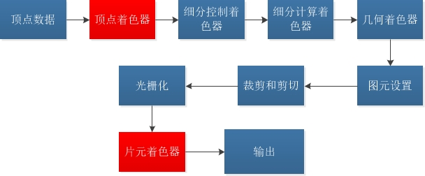
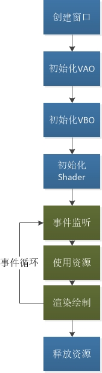

# 第一章 OpenGL概述

[TOC]

第一章涉及的内容相当广泛，这些内容都是OpenGL常见操作也是让OpenGL程序运行起来并不可少的。对这些内容的深入理解有助于后续的学习。第一章应该对OpenGL程序有大体上的理解。

## 一：概述

学习本书之前最好先学习OpenGL一些基本的概念和操作。本书可作为参考书，但对具体的实例化应用阐述不够，需要辅助学习(项目学习)。



重要概念：

- 渲染管线；
- 着色器：重点是**顶点着色器和片元着色器**；
- 状态绑定：OpenGL使用c语言编程，因此OOP概念不太完善，但它支持状态机；所有的对象都有一个主Context，Bind的时候就会把该对象绑定到主Context（表示正在使用）。例如，有三个VBO：VBO1、VBO2和VBO3，当VBO2调用Bind时候，表示当前正在使用的是VBO2。有两种情况需要绑定一个对象：一是设置对象的属性时，二是要使用对象时。


## 二：程序结构

以最简单的渲染三角形程序为例，分析OpenGL程序的常规结构。

### 2.1 程序

[01-triangles.cpp](../reference/01-triangles.cpp)

### 2.2 程序分析



#### 2.2.1 初始化VAO

**VAO(vertex-array object，顶点数组对象)：** 用于保存一组设置。当有多个设置时，如果不使用VAO则需要在使用时分别绑定，而使用了VAO之后就可以只绑定VAO，VAO记录的状态都会自动绑定。

初始化VAO包括VAO的创建、绑定和状态记录。

```c++
void glCreateVertexArrays(GLsizei n, GLuint *arrays);
void glBindVertexArray(GLuint array);
void glDeleteVertexArrays(GLsizei n, const GLuint *arrays);
GLboolean gllsVertexArray(GLuint array);
```

#### 2.2.2 初始化VBO

**VBO(vertor-buffer object，顶点缓冲对象)：** 用于保存一组顶点设置，例如一组顶点位置、一组顶点颜色或一组顶点纹理坐标。VBO保存这些数据之后需要传递到设备端，因为这些数据在设备计算时使用。

VBO初始化包括VBO的创建、绑定、内容填充、传递；也包括顶点属性的解释等。

VBO相关操作API：

```c++
void glGenBuffers(GLsizei n, GLuint *buffers);
void glBindBuffer(GLenum target, GLuint buffer);
void glDeleteBuffers(GLsizei n, const GLuint *buffers);
GLboolean gllsBuffer(GLuint buffer);
// 传递参数
void glNamedBufferStorage(GLuint buffer, GLsizeiptr size, const void *data, GLbitfield flags);
```

设置了VBO的内容之后一般要说明VBO内容的具体含义，也就是解释VBO。VBO的内容由属性来解释，属性值从0开始，默认为Disable状态。

```c++
void glVertexAttribPointer(GLuint index, GLint size, GLenum type, GLboolean normalized, GLsizei stride, const GLvoid *pointer);
void glEnableVertexAttribArray(GLuint index);
void glDisableVertexAttribArray(GLuint index);
```

比较重要的是 `glVertexAttribPointer` 的参数，这些参数定义了如何解释VBO内容。

#### 2.2.3 初始化Shader

用户最常用的时顶点着色器和片元着色器。顶点着色器输出 **gl_Position** 位置向量，这个变量由GLSL内部定义；片元着色器则输出颜色向量。

初始化Shader包括顶点着色器和片元着色器的初始化和编译链接。

Shader可以通过声明链接VBO的属性：

```c++
layout(location=i) in vec4 vPosition;
```

上述语句即链接了VBO的属性i到四维向量vPosition。注意GLSL中维数的自动填充，及当VBO相应属性没有设置足够维数时，GLSL会自动填充剩下的未定义维数，例如VBO的position属性只设置了二维，而GLSL链接属性时指明为vec4思维，那么剩下的两维会使用默认值。

#### 2.2.4 事件循环

事件循环主要负责事件处理（如键盘事件、鼠标事件等）和绘制渲染。渲染时候需要绑定渲染资源当当前Context，之后调用渲染接口Draw，渲染接口在后边章节介绍。

参考API：

```c++
// 清除缓存
void glClearBufferfv(GLenum buffer, GLint drawbuffer, const GLfloat *value);
// 绘制
void glDrawArrays(GLenum mode, GLint first, GLsizei count);
// 禁用启用属性
void glEnable(GLenum capability);
void glDisable(GLenum capability);
GLboolean gllsEnabled(GLenum capability);
```


