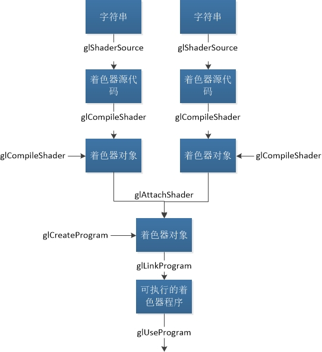

# 第二章 着色器基础

[TOC]


## 一：着色器介绍

任何OpenGL程序本质上分为两部分：CPU端运行的部分，采用C++之类的语言进行编写；以及GPU端运行的部分，使用GLSL语言编写。

由第一章介绍，着色器为级联方式，一级一级向下传递，因此，每一级的着色器数据传递有以下几种方式：

- 使用in或out声明的变量：这些变量指明是由上一级着色器传入还是由本级传递向下一级；
- 使用texture即纹理声明的变量：这些变量代表纹理贴图，可由程序直接传递数据；
- 使用uniform声明的变量：这些变量不是指着色器之间的传递，而是可以由程序直接传递。对于动态变化的值可以采用这种方式。

着色器是可选的，但 **顶点着色器** 和 **片元着色器** 是必须的，一般情况下我们也只需要编写这两个着色器。


## 二：着色器语法基础

### 2.1 GLSL程序结构

```c++
#version 330 core

// 变量声明...

void main()
{
    // 代码...
}
```

第一行声明GLSL使用的版本号和模式。

### 2.2 数据类型

- 基础数据类型：float、double、int、uint、bool；
- 组合数据类型：xvecn形式(x为基础类型缩写，n为维数)、matmxn、结构体、数组；
- 不透明数据类型：sampler、image、atomic counter。

具体的数据类型操作参书中内容。

数据存储限制符：

| 类型修饰符 | 描述                                                         |
| ---------- | ------------------------------------------------------------ |
| const      | 将一个变量定义为只读形式                                     |
| in         | 设置变量为着色阶段的输入变量                                 |
| out        | 设置变量为着色阶段的输出变量                                 |
| uniform    | 设置变量为用户应用程序传递给着色器的数据                     |
| buffer     | 设置应用程序共享的一块可读写内存，该内存也作为着色器中的存储缓存 |
| shared     | 设置变量为本地工作组中共享变量，只能用于计算着色器中         |

uniform操作：

```c++
GLint glGetUniformLocation(GLuint program, const char *name);
void glUniform{1234}{fdi ui}(GLint location, TYPE value);
void glUniform{1234}{fdi ui}v(GLint location, GLsizei count, const TYPE *values);
void glUniformMatrix{234}{fd}v(GLint location, GLsizei count, GLboolean transpose, const GLfloat *values);
void glUniformMatrix{2x3,2x4,3x2,3x4,4x2,4x3}{fd}v(GLint location, GLsizei count, GLboolean transpose, const GLfloat *values);
```

### 2.3 语句

```c++
if (truth) {
    // 条件为true分支
}
else {
    // 条件为false分支
}
```

```c++
switch(int_value)
{
case 0:
	break;
case 1:
    break;
default:
    break;
}
```

```c++
for (int i = 0;i < 10;i++) {
    // ...
}
```

```c++
while (n < 10)
{
    // ...
}
```

```c++
do {
	// ...    
} while(n < 10);
```

流控制：

| 语句     | 描述                                               |
| -------- | -------------------------------------------------- |
| break    | 终止当前循环                                       |
| continue | 终止本次循环，继续下一次                           |
| return   | 返回                                               |
| discard  | 丢弃当前片元，终止着色器执行（只在片元着色器有效） |

### 2.4 函数

```c++
returnType functionName([accessModifier] type1 var1, [accessModifier] type2 var2, ...)
{
	return returnValue;
}
```

accessModifier取值：

| 访问修饰符 | 描述                             |
| ---------- | -------------------------------- |
| in         | 将数据拷贝到函数（默认）         |
| const in   | 将只读数据拷贝到函数             |
| out        | 从函数中获取值                   |
| inout      | 将数据拷贝到函数并返回修改后的值 |

### 2.5 计算不变性

略

### 2.6 编译选项和预处理

略


## 三：着色器数据块

数据块的使用是为了简化数据的传递，类似于结构体的聚合作用。

### 3.1 Uniform块

### 3.2 Buffer块

### 3.3 in/out块


## 四：着色器编译

### 4.1 编译流程

着色器编译流程如图：



参考API：

```c++
// Shader
GLuint glCreateShader(GLenum type);
void glShaderSource(GLuint shader, GLsizei count, const GLchar **string, const GLint *length);
void glCompileShader(GLuint shader);
void glGetShaderInfoLog(GLuint shader, GLsizei bufSize, GLsizei *length, char *infoLog);
void glDeleteShader(GLuint shader);
GLboolean gllsShader(GLuint shader);
// Program
GLuint glCreateProgram(void);
void glAttachShader(GLuint program, GLuint shader);
void glDetachShader(GLuint program, GLuint shader);
void glLinkProgram(GLuint program);
void glGetProgramInfoLog(GLuint program, GLsizei bufSize, GLsizei *length, char *infoLog);
void glUseProgram(GLuint program);
void glDeleteProgram(GLuint program);
GLboolean gllsProgram(GLuint program);
```

### 4.2 着色器子程序

略

### 4.3 独立的着色器对象

略


